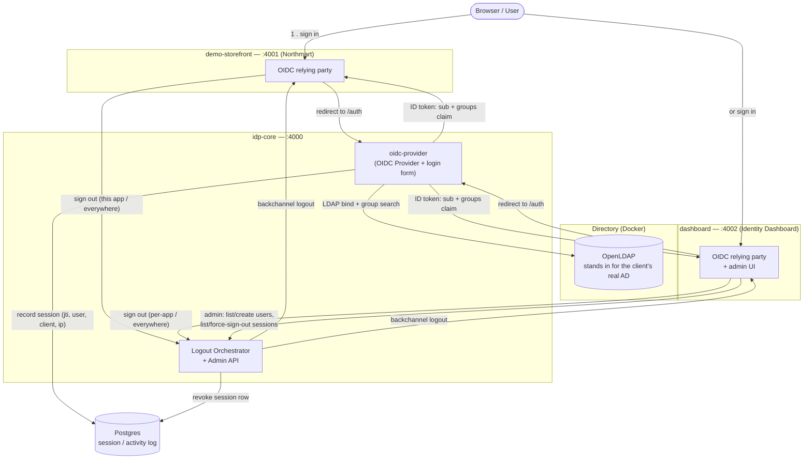

# AD SSO POC

A working, end-to-end proof of concept for the client's 5 requirements:

1. Single Sign-On authentication against Active Directory
2. Seamless SSO across multiple apps (one login, no repeated prompts)
3. Logging out of any app logs the user out of every other connected app
4. AD Roles/Groups are read at login and carried through to the platform
5. AD-defined permissions gate real UI in the connected apps

Plus an admin layer on top: a directory of every AD user and their group, a
live cross-user session monitor with force-sign-out, and self-service
provisioning of new AD accounts — all enforced by real server-side
authorization, not just hidden buttons.

All of this has been run and verified against real, running infrastructure —
real LDAP bind, real Postgres, real signed logout tokens over HTTP, a real
`oidc-provider` OIDC flow — not mocked.

## Architecture



**Two logout scopes, both real:**

- **"Sign out" (this app only)** — revokes just that app's own session record; the other app and the IdP-level SSO session stay alive.
- **"Sign out everywhere"** — fans out to every connected app _and_ ends the IdP's own SSO session (via `oidc-provider`'s `end_session_endpoint`), so the very next login shows a real login form instead of silently re-authenticating.

## What's here

```
packages/
  idp-core/         The Identity Provider — Node.js + oidc-provider + ldapts (LDAP client)
  demo-storefront/  "Northmart" — a polished demo e-commerce app (React/Vite/Tailwind),
                     an OIDC relying party, stands in for a real third-party site
  dashboard/        Your platform's dashboard — sidebar nav, login history + sign-out UI,
                     and an admin section (Users & Roles, Session Monitor, Add User)
  shared/           @ad-sso-poc/shared — the back-channel logout token sign/verify logic,
                     used by all three services (was duplicated per-package, now one copy)
docker-compose.yml  Real LDAP directory (openldap) + Postgres, both real containers
ldap-bootstrap/     Seed data for the directory (3 users, 2 groups)
docs/               SECURITY.md — the session-ownership fix and the admin-authorization model
.github/workflows/  CI — installs, lints, builds, and runs the full test suite against real
                     LDAP + Postgres containers on every push/PR
```

Each package also ships a `.env.example` listing the env vars it reads (with the same dev
defaults baked into the code, so copying it isn't required to run locally).

Each app package follows the same internal layout: `server/` (Express backend,
OIDC client, session handling) and `src/` (the React frontend), plus `test/`.

## Tech stack

| Layer                     | Choice                                                                                                           |
| ------------------------- | ---------------------------------------------------------------------------------------------------------------- |
| Identity Provider         | Node.js, Express, [`oidc-provider`](https://github.com/panva/node-oidc-provider)                                 |
| Directory                 | OpenLDAP (Docker) — swappable for the client's real AD                                                           |
| Directory client          | [`ldapts`](https://github.com/ldapts/ldapts)                                                                     |
| Session / activity store  | PostgreSQL (Docker)                                                                                              |
| Relying-party OIDC client | [`openid-client`](https://github.com/panva/node-openid-client)                                                   |
| Frontend                  | React + Vite + Tailwind CSS, [Inter](https://rsms.me/inter/) typeface, [lucide-react](https://lucide.dev/) icons |
| Tests                     | Vitest, Testing Library, Supertest                                                                               |
| Lint / format             | ESLint (flat config) + Prettier                                                                                  |
| CI                        | GitHub Actions — lint, build, test on every push/PR                                                              |

## Test accounts (seeded in the directory)

| Username | Password    | AD Group  |
| -------- | ----------- | --------- |
| alice    | Password123 | Admins    |
| bob      | Password123 | Employees |
| carol    | Password123 | Employees |

(A `dave` account may also exist if you've used the "Add User" admin feature.)

## Running it

```bash
# 1. Start the real directory + database
docker compose up -d
docker compose ps   # wait until both show "healthy"

# 2. Install everything (npm workspaces — one install for all 3 packages)
npm install

# 3. Build the two frontends (they're served as static bundles by their own backend)
npm run build   # or: npm run build --workspace demo-storefront / --workspace dashboard

# 4. Start all three services (separate terminals, or background them)
npm start --workspace idp-core          # http://localhost:4000
npm start --workspace demo-storefront   # http://localhost:4001
npm start --workspace dashboard         # http://localhost:4002
```

Then open **http://localhost:4001** (the storefront), click **Sign in**, log in as
`alice` / `Password123`. You'll land back on the storefront already authenticated.
Open **http://localhost:4002** (the dashboard) in the same browser — you will **not**
be asked to log in again (requirement 2). The dashboard's Overview shows your active
sessions and groups at a glance; "My Sessions" lets you sign out of one app at a time;
"Sign out everywhere" (header) ends every app's session plus the IdP's own SSO session.
Visit `/account` on the storefront as `alice` to see the Admin Panel section that only
appears because of her AD `Admins` group membership (requirements 4 & 5) — log in
as `bob` instead and it's gone.

Log in as `alice` and open the dashboard's **Users & Roles**, **Session Monitor**, and
**Add User** sections (admin-only — bob won't even see them in the sidebar, and hitting
their APIs directly as bob is rejected server-side).

## Running the tests

```bash
docker compose up -d   # idp-core's tests hit the real LDAP + Postgres containers
npm test               # runs all 3 packages' test suites
```

**Real results from this build: 56/56 tests passing** — idp-core 34 (LDAP bind +
groups, admin user/session management, session-ownership enforcement, logout-token
sign/verify, logout fan-out logic), demo-storefront 5 (admin-panel visibility by AD
group, per-app "sign out" behaviour), dashboard 17 (session list, admin nav gating,
admin proxy authorization, sign-out-everywhere → IdP end-session redirect).

## Swapping in the client's real Active Directory later

Only `packages/idp-core/src/ldap.js` needs to change — it does a plain LDAP bind
plus a group-membership search. Point `LDAP_URL`, `LDAP_USER_BASE`, `LDAP_GROUP_BASE`,
`LDAP_READER_DN`, and `LDAP_READER_PASSWORD` at the client's real directory (or its
LDAP-facing endpoint if it's Azure AD/Entra ID) and everything else — token issuance,
session tracking, logout fan-out, the two demo apps — needs no changes.

## Known simplifications (being upfront about what's scoped down for a POC)

- **`oidc-provider`'s own internal state (grants, tokens) is in-memory**, not
  persisted — restarting `idp-core` clears active OIDC sessions (you'd re-login).
  Swapping in a Redis/Postgres adapter for `oidc-provider` itself is a config change,
  not a redesign, if this needs to survive restarts.
- **`oidc-provider`'s signing keys are ephemeral** (auto-generated dev keys, with a
  console warning on startup) — production would supply real JWKS.
- **Back-channel logout is hand-rolled**, not `oidc-provider`'s built-in
  `features.backchannelLogout`. It follows the same token shape (issuer/subject/
  audience/events claim) but is signed with a single shared HS256 secret
  (`LOGOUT_TOKEN_SECRET`, same default in all 3 packages) rather than the IdP's
  own RS256 key + JWKS discovery. This was a deliberate simplification to keep the
  logout fan-out reliable and easy to verify within scope — it is fully wired and
  tested, just not spec-exact on the signing algorithm.
- **The `groups` claim inside an issued ID token is a login-time snapshot**
  (looked up from AD once, at login, and cached for that login) — a permission
  change in AD takes effect on the user's _next_ login, not instantly. Separately,
  admin-authorization _checks_ (the `Admins`-only API gate, and the "sign out
  someone else's session" override) do a **live** LDAP lookup on a cache miss, so
  those specifically don't depend on the actor having logged in since the last
  `idp-core` restart.
- Everything runs on plain HTTP on localhost with dev secrets committed as
  fallbacks in source (`*_dev_only` suffixed) — fine for a local demo, not for
  any shared/deployed environment.

See [`docs/SECURITY.md`](docs/SECURITY.md) for the session-ownership fix and the
admin-authorization model in more detail.
